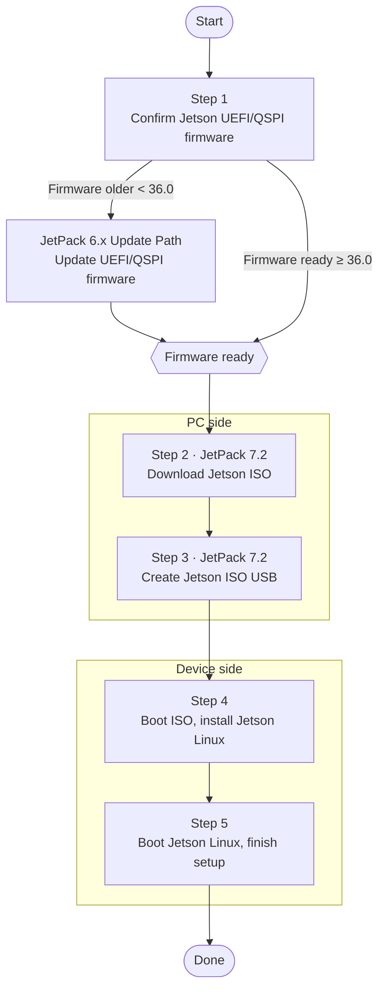

# Flash JetPack 7 (Orin Nano/NX)

Starting with **JetPack 7.2 (Jetson Linux r39.2, based on Ubuntu 24.04)**, the flashing method for Orin Nano/NX changed significantly: NVIDIA now uses a **Jetson ISO bootable-USB installer** that writes the OS to a microSD card or NVMe. **SD card images are no longer provided**, and SDK Manager is no longer required.

This guide covers the new ISO installer method, plus notes on third-party carrier boards (C1901/C1902) and SUPER mode.

::: warning Prerequisite: JetPack 6.x-generation firmware required
Installing JetPack 7.2 requires the device to already have **JetPack 6.x-generation UEFI/QSPI firmware (version `36.0` or newer)**.

- If your firmware is **≥ 36.0**, follow this guide directly.
- If it is **older than 36.0** (e.g. original factory firmware), you must **complete a JetPack 6.x install first** to bring the firmware to 36.x, then flash JetPack 7. See [Flash the Official Developer Kit](/en/flashing-guide/devkit-flashing) or the matching carrier-board guide to install JetPack 6.x first.
:::

## Scope

- **Modules**: Jetson Orin Nano / Orin NX
- **Version**: JetPack 7.2 (L4T r39.2)
- **Boards**: Official Developer Kit, plus reference-design third-party carrier boards (e.g. C1901, C1902). Third-party boards also need JetPack 6.x firmware first.

## Overall Flow

The process has a **PC-side** part (download and create the USB) and a **device-side** part (boot, install, and set up). Confirm the firmware path before you start:



> Maps to the sections below: Step 1 → Section 2, Steps 2–3 → Sections 1 & 3, Step 4 → Section 4, Step 5 → Section 5.

## 1. Preparation

| Item | Notes |
|------|-------|
| Jetson ISO image | `jetsoninstaller-r39.2.0-*-arm64.iso` (r39.2) |
| USB flash drive | Used to create the ISO installer (install media, not the system drive) |
| Target storage | **microSD** (64GB UHS-1 or larger) or **NVMe SSD** (recommended, more capacity and speed) |
| Balena Etcher | Tool to write the ISO to the USB drive |

Download the Jetson ISO (r39.2):

- Official download page: <https://developer.nvidia.com/embedded/jetpack/downloads>
- Direct link example: `https://developer.nvidia.com/downloads/embedded/L4T/r39_Release_v2.0/iso/jetsoninstaller-r39.2.0-*-arm64.iso`

Choose one target storage:


*microSD (64GB UHS-1 or larger)*


*NVMe SSD (recommended)*

## 2. Confirm the Current Firmware Version

Before flashing JetPack 7, confirm the device's UEFI/QSPI firmware is **≥ 36.0**. Use any one of these methods:

1. **With a monitor**: Connect a DisplayPort monitor and USB keyboard, power on, repeatedly press `Esc` at the NVIDIA boot splash to enter the UEFI setup menu, and read the firmware version.
2. **Headless serial**: Connect a USB-to-TTL serial cable to the Button Header (RXD = pin 3, TXD = pin 4, GND = pin 7), open a serial console, power on, and press `Esc` repeatedly to enter the UEFI menu.
3. **Boot media test**: Simply try booting the JetPack 7 install media (less precise; not recommended for an exact check).


*Reading the firmware version in the UEFI setup menu*


*Headless: a USB-to-TTL serial cable on the Button Header (RXD/TXD/GND)*

> If the version is older than `36.0`, complete the JetPack 6.x update from the "Prerequisite" box above before continuing.

## 3. Create the ISO USB

1. Open **Balena Etcher**.
2. Select the downloaded `jetsoninstaller-r39.2.0-*-arm64.iso`.
3. Select the USB drive to write.
4. Click **Flash** to write. When done you have a Jetson ISO installer USB.


*Balena Etcher*


*Select the ISO and the USB drive, then click Flash*

## 4. Boot the ISO and Install

1. Power off, insert the **ISO installer USB**, install the target storage (microSD or NVMe), and connect a monitor, keyboard, and power.
2. Power on and follow the installer:
   - When the **UEFI capsule (firmware) update** confirmation appears, press `Y` (about a 30-second timeout).
   - The device runs a **dual-pass UEFI capsule update** and reboots automatically in between — this is normal; do not cut power.
   - At the **GRUB menu**, select **`Install Jetson ISO r39.2`**.
   - Choose the target storage device (**microSD** or **NVMe**).
   - Confirm the install (this **erases the target storage**).
3. When done, **remove the USB**, reboot, and boot from the target storage.
4. Follow the prompts to complete the Ubuntu initial setup (language, time zone, keyboard, username, password).

## 5. Enable SUPER Mode

On first boot the default power mode is usually **25W**. Enabling maximum performance (SUPER mode) is **exactly the same as JetPack 6.2**:

1. Click the current power mode in the Ubuntu desktop top bar.
2. Select **Power Mode**.
3. Choose **MAXN SUPER**.


*Selecting MAXN SUPER in the power mode menu*

> Seeing the **25W** and **MAXN SUPER** options means SUPER mode is active (normal mode only has 7W / 15W).

## Other Flashing Methods (Optional)

The ISO installer is the method NVIDIA recommends, but the following two still work on JetPack 7.2 and suit headless, batch, or third-party-carrier-board scenarios:

### SDK Manager (Direct Flash)

On an Ubuntu host, use NVIDIA SDK Manager's **Direct Flash** to install the OS and the JetPack components (CUDA, cuDNN, TensorRT, etc.) in one guided flow. For host and SDK Manager setup, see [Install Ubuntu VM and SDK Manager](/en/flashing-guide/ubuntu-sdkmanager).

### Command-line initrd flash (third-party boards / SUPER firmware)

When Orin Nano/NX uses NVMe as external storage, NVIDIA recommends the `l4t_initrd_flash.sh` command-line flash. **Flashing SUPER firmware on a third-party board uses the exact same command as JetPack 6.2 — only change the JetPack directory version to `7.2`** (this relies on the official firmware cache, so complete at least one full flash with SDK Manager first).

Put the board into recovery mode (on C1901/C1902, short **FC REC** and **GND** with a jumper, connect Type-C to the host, and power on), close any running SDK Manager, then run:

```bash
cd /home/ubuntu/nvidia/nvidia_sdk/JetPack_7.2_Linux_JETSON_ORIN_NANO_TARGETS/Linux_for_Tegra
sudo ./tools/kernel_flash/l4t_initrd_flash.sh --external-device nvme0n1p1 \
  -c tools/kernel_flash/flash_l4t_t234_nvme.xml -p "-c bootloader/generic/cfg/flash_t234_qspi.xml" \
  --showlogs --network usb0 jetson-orin-nano-devkit-super internal
```

> The only difference from JetPack 6.2 is that `JetPack_6.2.1_...` in the path becomes `JetPack_7.2_...`; every other parameter (including `jetson-orin-nano-devkit-super`) stays the same. For full background and recovery-mode details, see the "Flash SUPER firmware via command line" section in [Flash the C1902](/en/flashing-guide/c1902-flashing).

## Troubleshooting

- **Stuck on firmware update / repeated reboots**: The dual-pass capsule update reboots several times — this is normal; never cut power mid-way.
- **No Install option in GRUB / cannot boot the ISO**: Confirm the firmware is ≥ 36.0 (see Section 2); older firmware needs the JetPack 6.x update first.
- **Target storage not found**: Confirm the microSD/NVMe is properly installed and detected; a single-sided NVMe SSD is recommended.

---

> Source: [NVIDIA Jetson Orin Nano Developer Kit — Quick Start Guide](https://docs.nvidia.com/jetson/orin-nano-devkit/user-guide/latest/quick_start.html)
