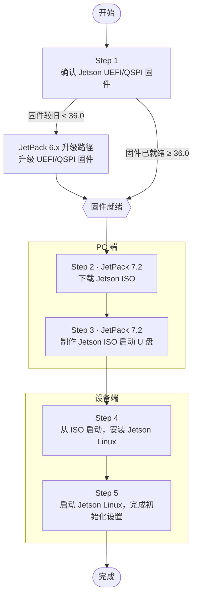

# JetPack 7 刷入系统 (Orin Nano/NX)

从 **JetPack 7.2（Jetson Linux r39.2，基于 Ubuntu 24.04）** 开始，Orin Nano/NX 的刷机方式发生了较大变化：官方改用 **Jetson ISO 启动盘安装**，通过 U 盘引导安装器把系统写入 microSD 或 NVMe，**不再提供 SD 卡镜像**，也不再必须使用 SDK Manager。

本页介绍这套新的 ISO 安装方式，并说明第三方载板（C1901/C1902 等）与 SUPER 模式的处理方法。

::: warning 关键前提：必须已具备 JetPack 6.x 代固件
JetPack 7.2 的安装依赖设备上已有 **JetPack 6.x 代的 UEFI/QSPI 固件（版本 `36.0` 或更新）**。

- 如果你的设备固件 **≥ 36.0**，可直接按本页进行。
- 如果固件 **低于 36.0**（例如出厂原始固件），必须**先完成 JetPack 6.x 升级**，把固件刷到 36.x 之后再来刷 JetPack 7。可参考本站 [官方开发者套件刷入系统](/flashing-guide/devkit-flashing) 或对应载板的刷机页先装一遍 JetPack 6.x。
:::

## 适用范围

- **核心卡**：Jetson Orin Nano / Orin NX
- **系统版本**：JetPack 7.2（L4T r39.2）
- **载板**：官方 Developer Kit，以及基于公版方案的第三方载板（如 C1901、C1902）。第三方载板同样需要先具备 JetPack 6.x 固件。

## 总体流程

整个过程分为 **PC 端**（下载并制作启动盘）和 **设备端**（启动安装并初始化）两部分，动手前先确认固件路径：



> 对应下文：Step 1 → 第二节，Step 2~3 → 第一、三节，Step 4 → 第四节，Step 5 → 第五节。

## 一、准备工作

| 物品 | 说明 |
|------|------|
| Jetson ISO 镜像 | `jetsoninstaller-r39.2.0-*-arm64.iso`（r39.2） |
| U 盘 | 用于制作 ISO 启动盘（安装介质，非系统盘） |
| 目标存储 | **microSD**（64GB UHS-1 及以上）或 **NVMe SSD**（推荐，容量与速度更好） |
| Balena Etcher | 把 ISO 写入 U 盘的工具 |

下载 Jetson ISO（r39.2）：

- 官方下载页：<https://developer.nvidia.com/embedded/jetpack/downloads>
- 直链示例：`https://developer.nvidia.com/downloads/embedded/L4T/r39_Release_v2.0/iso/jetsoninstaller-r39.2.0-*-arm64.iso`

目标存储二选一：


*microSD（64GB UHS-1 及以上）*


*NVMe SSD（推荐）*

## 二、确认当前固件版本

刷 JetPack 7 前，先确认设备的 UEFI/QSPI 固件版本是否 **≥ 36.0**。三种查看方式任选其一：

1. **接显示器**：接 DisplayPort 显示器 + USB 键盘，上电后在 NVIDIA 启动画面反复按 `Esc` 进入 UEFI 设置菜单，查看固件版本。
2. **串口无屏**：用 USB-TTL 串口线接 Button Header（RXD=针脚 3、TXD=针脚 4、GND=针脚 7），打开串口终端，上电后反复按 `Esc` 进入 UEFI 菜单查看。
3. **直接试引导**：直接尝试引导 JetPack 7 安装介质（较粗略，不推荐用于精确判断）。


*在 UEFI 设置菜单中查看固件版本*


*无屏时用 USB-TTL 串口线接 Button Header（RXD/TXD/GND）*

> 若版本低于 `36.0`，请先按上面的「关键前提」完成 JetPack 6.x 升级，再继续。

## 三、制作 ISO 启动盘

1. 打开 **Balena Etcher**。
2. 选择下载好的 `jetsoninstaller-r39.2.0-*-arm64.iso`。
3. 选择要写入的 U 盘。
4. 点击 **Flash** 写入，完成后得到一个 Jetson ISO 启动盘。


*Balena Etcher*


*选择 ISO 与 U 盘后点击 Flash 写入*

## 四、从 ISO 启动并安装系统

1. 断电，插入制作好的 **ISO 启动 U 盘**，装好目标存储（microSD 或 NVMe），接上显示器、键盘、电源。
2. 上电启动，进入安装流程：
   - 出现**固件胶囊更新（UEFI capsule update）**确认时按 `Y`（有约 30 秒超时）。
   - 会执行**两轮（dual-pass）UEFI 胶囊更新**，期间会自动重启，属正常现象，请勿断电。
   - 进入 **GRUB 菜单**后选择 **`Install Jetson ISO r39.2`**。
   - 选择目标存储设备（**microSD** 或 **NVMe**）。
   - 确认安装（该操作会**擦除目标存储上的数据**）。
3. 安装完成后**拔掉 U 盘**，重启，从目标存储引导进入系统。
4. 按提示完成 Ubuntu 初始化设置（语言、时区、键盘、账号密码）。

## 五、开启 SUPER 模式

首次进入系统后，默认电源模式通常为 **25W**。开启最大性能（SUPER 模式）的方法**与 JetPack 6.2 完全一致**：

1. 点击 Ubuntu 桌面顶栏当前的电源模式。
2. 选择 **Power Mode**。
3. 选择 **MAXN SUPER**。


*在电源模式菜单中选择 MAXN SUPER*

> 出现 **25W** 与 **MAXN SUPER** 档位，即表示已工作在 SUPER 模式（普通模式只有 7W / 15W 两档）。

## 其他刷机方式（可选）

ISO 安装是官方主推方式，但以下两种在 JetPack 7.2 上仍然可用，适合无显示器、批量或第三方载板场景：

### SDK Manager（Direct Flash）

在 Ubuntu 主机上用 NVIDIA SDK Manager 的 **Direct Flash** 一次性完成系统与 JetPack 组件（CUDA、cuDNN、TensorRT 等）的安装。主机与 SDK Manager 的安装参考 [安装 Ubuntu 虚拟机和 SDK Manager](/flashing-guide/ubuntu-sdkmanager)。

### 命令行 initrd 刷机（第三方载板 / SUPER 固件）

Orin Nano/NX 以 NVMe 为外部存储时，官方推荐用 `l4t_initrd_flash.sh` 命令行刷机。**第三方载板刷入 SUPER 固件的命令与 JetPack 6.2 完全相同，只需把 JetPack 目录的版本号改为 `7.2`**（此操作依赖官方固件缓存，请先用 SDK Manager 完成至少一次完整烧录）。

先让载板进入恢复模式（C1901/C1902 用跳线帽短接 **FC REC** 和 **GND**，Type-C 连接主机并上电），关闭正在运行的 SDK Manager，然后执行：

```bash
cd /home/ubuntu/nvidia/nvidia_sdk/JetPack_7.2_Linux_JETSON_ORIN_NANO_TARGETS/Linux_for_Tegra
sudo ./tools/kernel_flash/l4t_initrd_flash.sh --external-device nvme0n1p1 \
  -c tools/kernel_flash/flash_l4t_t234_nvme.xml -p "-c bootloader/generic/cfg/flash_t234_qspi.xml" \
  --showlogs --network usb0 jetson-orin-nano-devkit-super internal
```

> 与 JetPack 6.2 唯一的区别就是路径里的 `JetPack_6.2.1_...` 换成了 `JetPack_7.2_...`，其余参数（含 `jetson-orin-nano-devkit-super`）保持不变。完整背景与恢复模式说明可参见 [C1902 刷入系统](/flashing-guide/c1902-flashing) 的「命令行刷入 SUPER 固件」一节。

## 常见问题

- **卡在固件更新 / 反复重启**：dual-pass 胶囊更新期间会自动重启多次，属正常，切勿中途断电。
- **GRUB 里没有 Install 选项 / 无法引导 ISO**：确认设备固件已 ≥ 36.0（见第二节），旧固件需先走 JetPack 6.x 升级。
- **找不到目标存储**：确认 microSD/NVMe 已正确安装并被识别；NVMe 建议使用单面 SSD。

---

> 参考来源：[NVIDIA Jetson Orin Nano Developer Kit — Quick Start Guide](https://docs.nvidia.com/jetson/orin-nano-devkit/user-guide/latest/quick_start.html)
